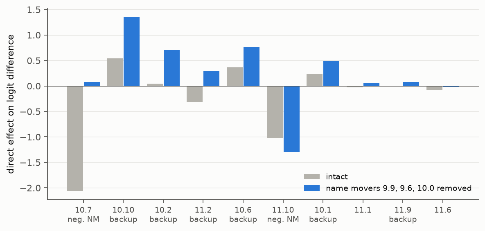
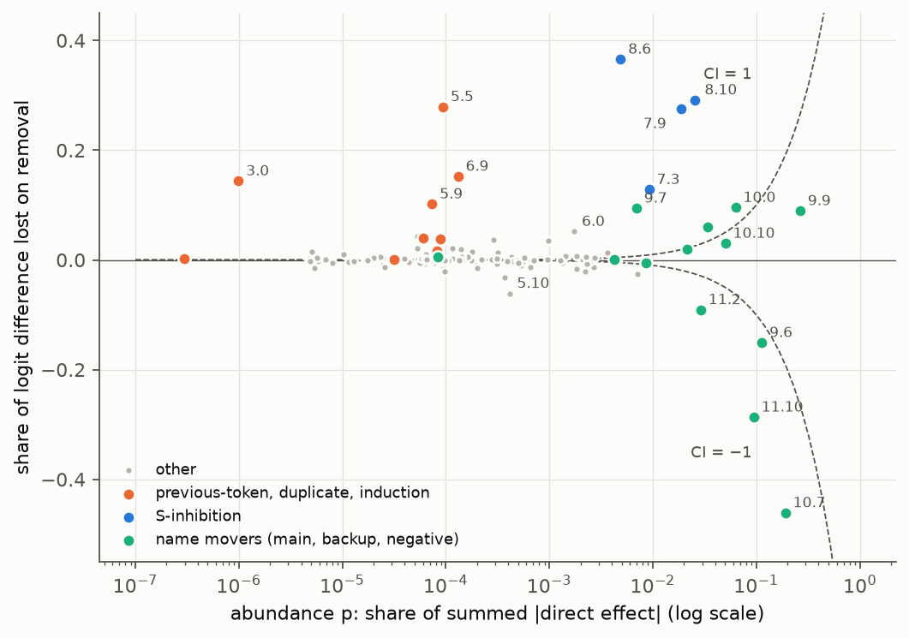
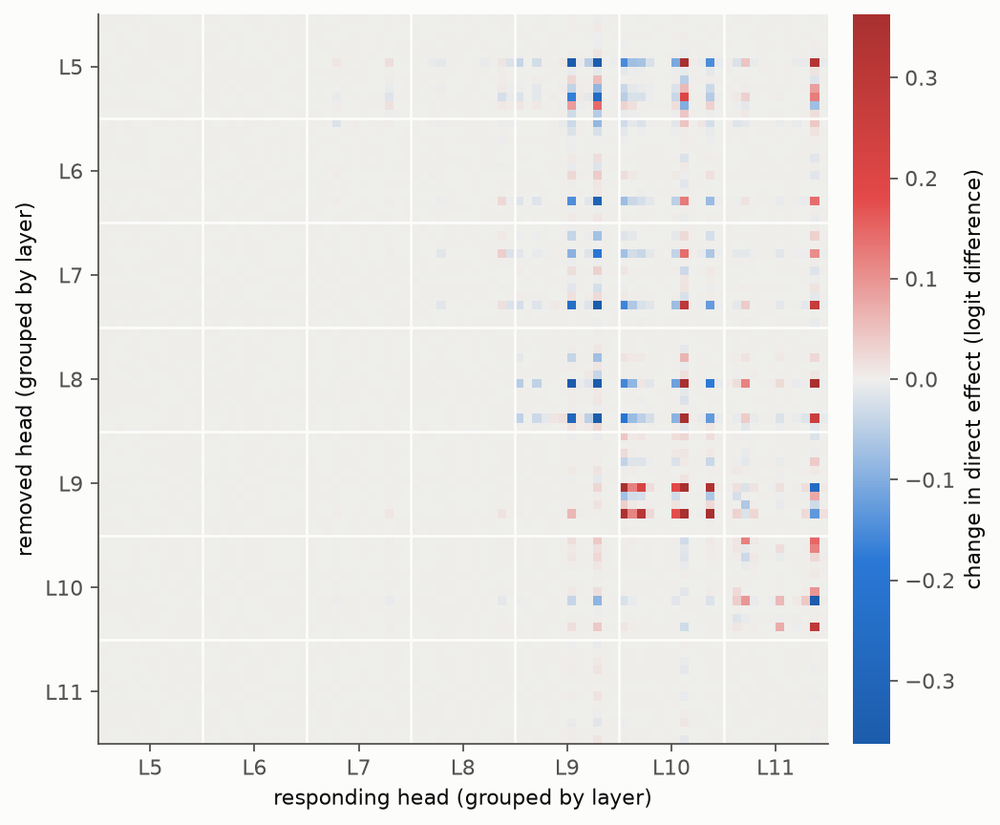
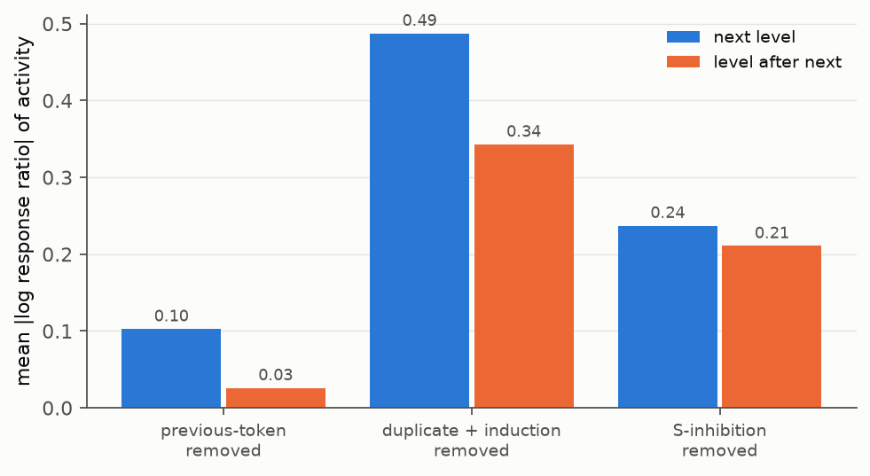
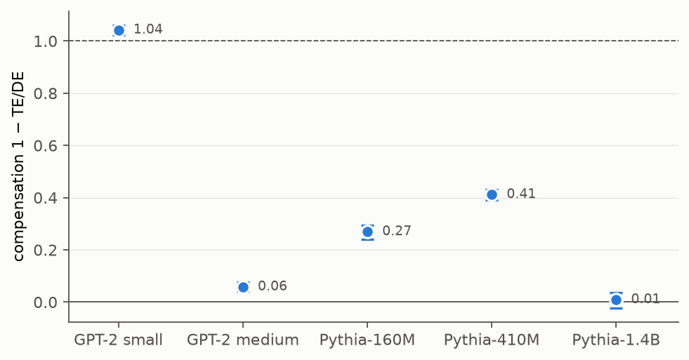
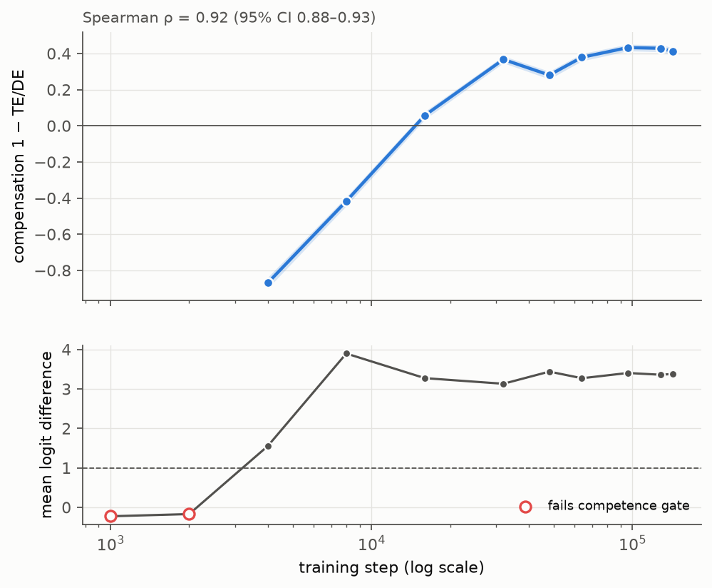

# Trophic Cascades in a Transformer: Mesopredator Release, Keystone Heads, and Whether Dropout Produces Them

| created | modified | status | confidence | importance |
|---|---|---|---|---|
| 2026-09-24 | 2026-09-24 | in progress | – | 4 |

> **Abstract.** *Pre-registration version. Sections 1–4 state the question, the hypotheses, and the design, and were committed before any of the registered experiments was run; the results, discussion, and this abstract are added once they have been.* Ecologists measure the structure of a community by removing a species and recording what happens to the others, and have a vocabulary for the results: interaction strength, mesopredator release, keystone species, the attenuation of a cascade with trophic distance, and the hydra effect, in which added mortality increases a population. Interpretability researchers measure the structure of a transformer by ablating a component and recording what happens to the others, and have found that later components often restore part of what was removed ("self-repair", the "Hydra effect"). This report applies the ecological measures, with their published definitions, to attention heads: first to the indirect-object-identification circuit of GPT-2 small, then to four other pretrained models and to the training checkpoints of Pythia-410M, and finally to eighteen small models trained from scratch on TinyStories with no dropout, standard dropout, or head-level dropout, which tests the conjecture of Wang et al (2022) that compensation of this kind "is caused by the use of dropout during training".

## Summary without the terminology

A language model is built from many small components. When one of them is removed, other components often take over part of its function. Ecologists study the same kind of event when they remove a predator from a stretch of coast or a lake and record how the other species respond, and they have developed measurements for it. This report uses their measurements to ask two questions: how does this replacement work inside a model, and what produces it?

**Part A** removes components from trained models on one well-studied task. The model reads "When Mary and John went to the store, John gave a drink to" and must answer "Mary"; earlier work identified which components of GPT-2 carry out this task.

1. **When the main components are removed, other components take over all of their function.** GPT-2 relies mostly on three components to produce the answer. With all three removed, it prefers the correct name slightly more strongly than before. Backup components that contributed little begin to produce the answer, and a component whose normal role is to reduce the model's confidence in that answer stops doing so, because the signal it acts on is gone. Ecologists call the first pattern *mesopredator release*: when a top predator is removed, smaller predators increase.
2. **The components that matter most are not the ones that contribute most directly.** Several components have almost no direct effect on the answer, yet removing any one of them reduces the model's preference for the correct name by as much as a third, because they direct the components that do produce it. Ecologists call a species of this kind a *keystone*: its effect is large relative to its numbers. The components predicted to be keystones were keystones; one main component was predicted not to be one in this sense and was, by a small margin.
3. **The effect of a removal decreases with distance.** Removing a component changes the components that receive its output directly more than it changes the components one step further on, as removing a predator changes the animals it eats more than the plants those animals eat.
4. **Not every model does this.** Four of five models tested take over the function of removed components; the fifth, Pythia-1.4B, performs the task equally well but does not: when its main components are removed, no other component replaces them. The prediction that every capable model would do it was therefore wrong, and the amount varies between models from none to more than all of what was removed.
5. **The replacement develops during training, after a stage in which the opposite happens.** Measured at eleven points during the training of one model, removing the main components early in training caused *more* damage than those components contributed: the rest of the model reduced its preference for the correct name further, instead of restoring it. Later in training this reversed, and the model came to restore about 40% of what a removed component contributed, which is the pattern ecologists describe for a community that becomes more stable as it matures.

**Part B** tests where the replacement comes from. The researchers who first described the backup components suggested that they exist because of *dropout*, a training method that switches random components off during training so that the model cannot depend on any one of them. The suggestion had not been tested. Eighteen small models were trained from scratch on the same data, identical except for the training method (no dropout, standard dropout, or a form of dropout that switches off whole components), six of each, and each was measured for how much of a removed component's function the rest of it restores. A second comparison checks that any difference is due to dropout itself rather than to dropout models being less fully trained after the same amount of data. The results are in §5.8.

## 1. Background

### 1.1 Removal experiments in ecology

In 1963 Robert Paine began prying the predatory starfish *Pisaster ochraceus* off an 8-metre stretch of rocky shore at Mukkaw Bay, Washington, and keeping it clear of them. Barnacles settled on the bare rock, then mussels, which the starfish had been eating, overgrew the barnacles, algae, and other attached species; the plot went from fifteen species of primary space holders to eight ([Paine 1966](#references); [Lafferty & Suchanek 2016](#references)). The starfish ate few of the species that disappeared; its effect on them ran through the mussel. The same removal *increased* diversity by another measure, since a mussel bed is habitat for more than 300 associated species ([Lafferty & Suchanek 2016](#references)): what a removal experiment shows depends on which property of the community is measured, a point that applies with equal force below. [Paine 1969](#references) called a species of this kind a *keystone*. The same pattern, a predator whose removal changes the abundance of species two or more feeding levels below it, was found for sea otters, sea urchins, and kelp ([Estes & Palmisano 1974](#references)), for piscivorous fish, zooplankton, and algae in lakes ([Carpenter et al 1985](#references)), and for wolves, elk, and riparian willow and aspen in Yellowstone after 1995 ([Ripple & Beschta 2004](#references); [Ripple & Beschta 2012](#references)). The general term is a *trophic cascade*; the earliest general argument for it is [Hairston et al 1960](#references).

The field turned these observations into measurements, and four of its measures are used below.

- **Interaction strength.** The effect of species *i* on species *j* is measured by removing *i* and recording the change in *j* ([Paine 1992](#references)). [Berlow et al 1999](#references) compare the indices in use and recommend reporting the raw difference alongside ratio measures, because ratios are unstable when the baseline is small.
- **The log response ratio.** For a quantity that is always positive, such as a density, the response to a treatment is ln(treated / control); it is symmetric in increases and decreases and has a known sampling distribution ([Hedges et al 1999](#references)). [Shurin et al 2002](#references) used it to compare 102 predator-removal experiments across six ecosystem types, and found that predator effects on herbivores were larger than predator effects on plants: cascades *attenuate* with each step down the food web. [Borer et al 2005](#references) extended the comparison to 114 studies and found that traits of the predators and herbivores explain about a third of the variation in cascade strength.
- **Community importance.** [Power et al 1996](#references) define a keystone as a species "whose impact on its community or ecosystem is large, and disproportionately large relative to its abundance", and make it operational as community importance, CI_i = [(t_N − t_D) / t_N] · (1 / p_i), where t_N is a community trait in the intact community, t_D the same trait after species *i* has been deleted, and p_i the proportional abundance of *i* before deletion. A species whose effect is in proportion to its abundance has CI = 1; a keystone has CI well above 1. The authors note that the full effect, "all the direct and indirect effects of the species", is what a removal measures.
- **Press and pulse.** [Bender et al 1984](#references) distinguish a *pulse* perturbation, a one-time change in abundance after which the system is allowed to return, from a *press* perturbation, a sustained change held until the system settles into a new state. Species removal is a press.

Two outcomes of removal experiments have their own names. In *mesopredator release*, removing a top predator allows a smaller predator to increase: in fragmented scrub habitat near San Diego, canyons from which coyotes had disappeared held more domestic cats, raccoons, and foxes, and fewer species of scrub-breeding birds ([Crooks & Soulé 1999](#references)). In the *hydra effect* of population ecology, an increase in a population's mortality rate increases its equilibrium size, a result first seen in discrete density-dependent models in 1954 and reviewed by [Abrams 2009](#references). A third idea concerns where compensation comes from. The *insurance hypothesis* ([Yachi & Loreau 1999](#references)) holds that a community of species which respond differently to environmental fluctuation maintains its aggregate function better than a community of identical species, because the loss of one is offset by the others. The hypothesis predicts that redundancy is a product of variable conditions.

### 1.2 Removal experiments in transformers

The standard experiment in mechanistic interpretability is the same one. A component, most often an attention head, is *ablated*: its output is replaced by its mean over a reference distribution (mean ablation), by its output on a different input (resample ablation), or by zero, and the model's output is compared with the unablated model's ([Heimersheim & Nanda 2024](#references); [Zhang & Nanda 2024](#references)). The quantity that plays the role of a population's abundance is the component's *direct effect*: in a transformer the final residual stream is a sum of the outputs of every head and every MLP layer, so each component's contribution to a given logit can be read off by projecting its output through the final normalisation and the unembedding ([Elhage et al 2021](#references)).

[Wang et al 2022](#references) reverse-engineered the circuit GPT-2 small ([Radford et al 2019](#references)) uses to complete sentences such as "When Mary and John went to the store, John gave a drink to", in which the correct continuation is the name that is not repeated, the *indirect object* (IO). They identified 26 heads in seven classes (§4.2). The three heads with the largest direct effect, which they called *name movers* (9.9, 9.6, 10.0 in layer.head notation), attend from the last position to the IO and copy it to the output. When all three were knocked out, the logit difference between the IO and the repeated subject fell by only 5%, because eight other heads, which they named *backup name movers*, increased their direct effect to replace them. They wrote: "We hypothesize that this compensation phenomenon is caused by the use of dropout during training. Thus, the model was optimized for robustness to dysfunctional parts. More work is needed to determine the origin of this phenomenon." That hypothesis has not, to my knowledge, been tested.

[McGrath et al 2023](#references) found the same behaviour at the level of whole layers in a 7-billion-parameter Chinchilla-architecture model and named it the *Hydra effect*, after the mythological animal rather than the ecological term.[^hydra] Ablating one attention layer caused later attention layers to increase their direct effects, and certain late MLP layers, which normally reduce the logit of the most likely token, reduced it less ("erasure"). Their model was "trained entirely without dropout, stochastic depth, or layer dropout", which establishes that dropout is not *necessary* for compensation. Whether it *increases* compensation is a separate question. [Rushing & Nanda 2024](#references) measured compensation across the Pythia suite, GPT-2 small and medium, and Llama-7B on a million tokens of each model's pretraining distribution, defined *self-repair* as the change in the logit minus the change in the ablated head's direct effect, and found it widespread but imperfect and noisy. In their words "possibly 30%" of it runs through the final LayerNorm: removing a head changes the norm of the residual stream, and the normalisation rescales every surviving component accordingly. [McDougall et al 2024](#references) explained one head in detail: GPT-2's 10.7, one of Wang et al's two *negative* name movers, suppresses the logit of tokens that appear earlier in the context and that earlier layers are already predicting, so when the name movers are removed it has less to suppress; it accounts for about 39% of self-repair in the IOI task. [Tigges et al 2024](#references) followed the IOI circuit through the training checkpoints of the Pythia models and found that individual name-mover heads gain and lose the behaviour over training while the circuit's algorithm stays the same; they attribute the stability in part to self-repair and leave the mechanism to future work.

Three 2026 preprints bear on the present design. [Gong et al 2026](#references) rank candidate backup heads by the growth of their ablation effect after a primary set has been removed, which is, in ecological terms, a removal-based interaction strength; on GPT-2's IOI circuit it recovers Wang et al's backup heads at 0.94 ROC-AUC. [Patrawala et al 2026](#references) find that adjacent layers systematically counteract parts of each other's output on nearly all tokens in five of seven model families. [Rohweder et al 2026](#references) derive the Hydra effect, together with induction heads and function vectors, from hierarchical structure in the training data and decorrelated gradients across additive components, an account in which dropout plays no part.

### 1.3 The correspondence, and where it fails

| Ecology | Transformer, as measured here |
|---|---|
| species | attention head |
| abundance; proportional abundance p_i | direct effect of the head on the logit difference, relative to its mean-ablated value; p_i is its share of the summed absolute direct effect of all heads |
| removal (a press perturbation) | mean ablation of the head's output for the whole forward pass |
| community trait t | mean logit difference, logit(IO) − logit(S) |
| interaction strength of *i* on *j* | change in *j*'s direct effect when *i* is removed |
| density, and its log response ratio | a head's *activity*, the norm of its output relative to its mean, and ln(activity with *i* removed / activity intact) |
| mesopredator release | an increase in the direct effect of backup heads when the name movers are removed |
| hydra effect | compensation greater than 100%: the trait rises when a component that supports it is removed |
| trophic level | position in the IOI circuit's chain of dependence (§4.2) |
| a disturbance regime during community assembly | dropout during training |

The correspondence has limits that bear on how the results should be read. A transformer's forward pass is a directed acyclic graph: a head can affect only heads in later layers, and nothing downstream feeds back. Ecological cascades run through feedback over many generations and settle at a new equilibrium; the "response" here is computed in a single pass, with no dynamics and no equilibrium. Mean ablation fixes a head at its average output rather than deleting it, so it removes the head's input-dependent information and leaves its average contribution in place; it is closer to holding a population at a constant density than to extinction. And a head's direct effect on one logit difference is a narrow measure of its "abundance", as biomass is of a species'. The report uses the ecological measures because they come with precise definitions and a record of what they reveal in the systems they were built for, not because a transformer is an ecosystem; §6 assesses which of them measured something the standard interpretability quantities do not.

## 2. Hypotheses

Recorded before any of the registered experiments was run. One observation preceded them. On 2026-09-24, while checking that the measurement code reproduced Wang et al's baseline (§4.2), I mean-ablated the three name movers of GPT-2 small on the 600 prompts of §3.1 and found that the logit difference *rose*, from 3.65 to 3.85, where Wang et al report a 5% fall. H1 is therefore a replication with a known point estimate, and is stated so that it can still fail on its interval and its attribution. Every other hypothesis concerns a quantity that had not been computed when it was written.

**Part A: pretrained models, the IOI task.**

- **H1 (mesopredator release).** In GPT-2 small, mean-ablating the name movers {9.9, 9.6, 10.0} as a set gives compensation c = 1 − TE/DE whose 95% bootstrap interval lies above 0 (TE: fall in mean logit difference; DE: the three heads' summed mean direct effect). At least half of the offset, the summed change in direct effect over every component not ablated, is carried by Wang et al's eight backup name movers and two negative name movers together.
- **H2 (keystones).** A head is a *keystone* if its single-head removal changes the mean logit difference by at least 5% and its community importance satisfies |CI| ≥ 2. At least three of the four S-inhibition heads, and at least one of the previous-token, duplicate-token, or induction heads, are keystones. None of the three name movers is: the heads with the largest abundance have CI < 1, because of H1.
- **H3 (attenuation).** Take the circuit levels L1 previous-token, L2 duplicate-token and induction, L3 S-inhibition, L4 name mover, L5 negative name mover (§4.2). When all the heads of level *k* are removed together, the mean absolute log response ratio of activity is larger for the heads of level *k*+1 than for those of level *k*+2, for each of *k* = 1, 2, 3, with the bootstrap interval of the difference above 0 in at least two of the three.
- **H4 (generality).** In every pretrained model that passes a competence gate (IO preferred on at least 80% of prompts, mean logit difference at least 1.0), mean-ablating the three heads with the largest positive direct effect gives compensation whose 95% interval lies above 0. Models: GPT-2 small and medium, Pythia-160M, -410M, and -1.4B. No prediction is made about the size of c or its relation to model size.
- **H5 (development).** Over the Pythia-410M checkpoints of §4.5 that pass the competence gate, compensation of the top three heads rises with training: the Spearman correlation between training step and c is positive, with a bootstrap interval above 0. The ecological motivation is that mature communities are more internally buffered than early-successional ones ([Odum 1969](#references)); the interpretability motivation is the open question left by [Tigges et al 2024](#references).

**Part B: small models trained from scratch, three training regimes.**

- **H6 (dropout produces redundancy).** Small GPT-2-architecture models trained on TinyStories with standard dropout (p = 0.1 on embeddings, attention weights, and residual branches) show a larger pooled self-repair fraction on held-out text (§4.6) than the same models trained without dropout, paired by seed: the mean difference over six seeds is positive with a 95% interval above 0, and positive for at least five of the six seeds. Models trained with head-level dropout (DropHead, [Zhou et al 2020](#references); p = 0.1 on each head's output, no other dropout) show a larger self-repair fraction than standard dropout, by the same criterion. The predicted order is none < standard < DropHead. This is the insurance hypothesis in the form Wang et al stated it: training under random loss of components produces components that cover for one another. It concerns magnitude, not existence; McGrath et al and Rushing & Nanda have already shown compensation without dropout.
- **H6c (not an artefact of undertraining).** Dropout slows the fall of the training loss, and a less-trained model might differ in self-repair for that reason alone. The ordering of H6 also holds when each dropout run is compared with the checkpoint of its paired no-dropout run whose validation loss is closest to its own.

Each hypothesis receives a verdict in §6.1, and the document's confidence tag is set in the `[^conf]` footnote after the results are in.

## 3. Data

### 3.1 IOI prompts

Fifteen sentence templates, those of Wang et al's BABA set, each filled 40 times with a random IO name, subject name, place, and object, half with the IO first in the opening clause (ABBA) and half with the subject first (BABA): 600 prompts, seed 0 (`trophic/ioi.py`). Names, places, and objects are restricted to words that are single tokens, with a leading space, under both the GPT-2 and the Pythia tokenizer, so that the same 600 prompts are given to every model, and every prompt of a template has the same length in tokens. 72 names, 17 places, and 18 objects qualify. Each prompt has an *ABC* twin: the same template, name order, place, and object, with three other distinct names, so that no name repeats. The ABC prompts preserve the sentence structure and remove the repetition the circuit depends on; their activations are the reference for mean ablation.

### 3.2 TinyStories

The TinyStories corpus of [Eldan & Li 2023](#references), about 2.1 million short stories written by GPT-3.5 and GPT-4 in the vocabulary of a young child, tokenized with the GPT-2 tokenizer, concatenated with an end-of-text token between stories, and cut into sequences of 256 tokens. The published validation split is held out for validation loss and for the self-repair measurement.

## 4. Method

### 4.1 Measurement

All pretrained models are loaded with TransformerLens 3.9 ([Nanda & Bloom 2022](#references)) with its default weight processing, under which the final residual stream is exactly the sum of per-component outputs, so that direct effects add up to the logit difference (a unit test checks this to 0.01). For a prompt with correct answer IO and repeated subject S:

- the **logit difference** is logit(IO) − logit(S) at the last position;
- a head's **direct effect** is its output at the last position, minus its ABC mean, divided by the final LayerNorm scale and projected on W_U[IO] − W_U[S]; a mean-ablated head has direct effect 0. It is computed both with the scale of the run in question and with the scale of the intact run, and the difference between the two is the share of any change that runs through normalisation ([Rushing & Nanda 2024](#references));
- a head's **activity** is the norm of its output, (z − z̄)W_O, at the position where its class acts in the IOI circuit: S1+1 for previous-token heads, S2 for duplicate-token and induction heads, the last position for all others.

Mean ablation replaces the head's pre-projection output z, at every position, by its mean over the 40 ABC prompts of the same template at that position. Resample ablation, which substitutes the z of the paired ABC prompt, is run once on GPT-2 small as a check that no conclusion depends on the choice (§5). Intervals are percentile bootstraps over the 600 prompts, 2,000 resamples.

### 4.2 The GPT-2 small circuit

The head classes of Wang et al, Figure 2, used as the trophic levels of H3 and the named sets of H1 and H2:

| Level | Class | Heads (layer.head) |
|---|---|---|
| L1 | previous-token | 2.2, 4.11 |
| L2 | duplicate-token | 0.1, 3.0, 0.10 |
| L2 | induction | 5.5, 6.9, 5.8, 5.9 |
| L3 | S-inhibition | 7.3, 7.9, 8.6, 8.10 |
| L4 | name mover | 9.9, 9.6, 10.0 |
| – | backup name mover | 9.0, 9.7, 10.1, 10.2, 10.6, 10.10, 11.2, 11.9 |
| L5 | negative name mover | 10.7, 11.10 |

Backup name movers are not assigned a level: they operate beside the name movers rather than downstream of them.

### 4.3 Part A experiments

1. **Single-head removals** in GPT-2 small: each of the 144 heads mean-ablated alone, giving the 144 × 144 interaction-strength matrix, every head's community importance, and every head's compensation (H2).
2. **Set removals**: the name movers (H1); each circuit level (H3); every class.
3. **Other models** (H4): GPT-2 medium, Pythia-160M, -410M, -1.4B, with the three heads of largest positive mean direct effect chosen automatically in each.
4. **Checkpoints** (H5): Pythia-410M at steps 1,000, 2,000, 4,000, 8,000, 16,000, 32,000, 48,000, 64,000, 96,000, 128,000, and 143,000 (the final model), with the top three heads re-selected at each checkpoint, since [Tigges et al 2024](#references) show they change.

### 4.4 Part B: models and training

GPT-2 architecture (Hugging Face `GPT2LMHeadModel`), 6 layers, 8 heads of dimension 48 (d_model 384), MLP width 1,536, context 256, tied embeddings, GPT-2 tokenizer. AdamW, peak learning rate 1e-3 with 2% linear warm-up and cosine decay to 10%, weight decay 0.1, batch 128 sequences (32,768 tokens). The token budget is fixed, identical in every run, before the sweep, from a single timing run, at the largest multiple of ten million tokens that trains in 20 minutes or less on a Colab A100; it is chosen on throughput and is not revised after any result is seen.

Three arms:

| Arm | Embedding, attention, residual dropout | Head dropout |
|---|---|---|
| none | 0 | 0 |
| standard | 0.1 | 0 |
| drophead | 0 | 0.1 |

Head dropout zeroes each head's output independently, per sequence, with probability 0.1 during training, and scales the surviving heads' outputs by 1/0.9. Six seeds (0–5) per arm, 18 runs, run as one W&B sweep. The seed fixes both the initialisation and the order of the training sequences, so that the three arms of one seed see the same data in the same order and differ only in the regime.

### 4.5 Part B: measurement

Every model is measured in evaluation mode, with all dropout off, so that the arms differ only in how they were trained. Measurement runs inside the training job at eight evenly spaced points (after each eighth of the token budget), which gives the development of self-repair over training and the checkpoints needed for H6c without storing them.

At each point, 256 held-out sequences (65,536 token positions) are run intact and then once with each of the 48 heads resample-ablated, taking the head's output from the next sequence in the batch at the same position. For each head and position, following [Rushing & Nanda 2024](#references), Δlogit is the change in the logit of the correct next token, and ΔDE the change in the head's own direct effect on that logit, computed with the intact run's final-LayerNorm scale, so that compensation through normalisation counts as self-repair. Self-repair is Δlogit − ΔDE. For each head the positions are restricted to the 2% on which its intact direct effect is largest, as Rushing & Nanda do, so that the measure concerns the head's function rather than noise. The primary quantity is the **pooled self-repair fraction**, the sum of self-repair over all heads and their selected positions divided by the sum of −ΔDE, which is the share of removed direct effect that the rest of the model restores. The unweighted mean over heads of each head's fraction is reported as a secondary measure.

### 4.6 Statistics for Part B

The unit is the seed. For each contrast (standard − none, drophead − standard, drophead − none) the six within-seed differences give a mean, a 95% t interval, and a sign count; with six units, six of six positive is the only sign count with two-sided p < 0.05 under a sign test, and five of six is recorded as consistent but not significant on its own. Validation loss is reported for every arm, because dropout changes it.

## 5. Results

Part A was run twice: on a local GTX 1070 (W&B runs tagged `local-gtx1070`) and on a Colab A100 (the reference set, `notebooks/01_part_a.ipynb`). The two agree to the fifth decimal place on every quantity reported below (baseline logit difference 3.645846 against 3.645847; name-mover compensation 1.041904 against 1.041904; identical keystone lists), and the prompt file was byte-identical, so the numbers are properties of the models and prompts rather than of the hardware. Pythia-1.4B and the checkpoints were run on the A100 only.[^oom]

### 5.1 Baseline

GPT-2 small prefers the IO to the subject on 99.0% of the 600 prompts, with mean logit difference 3.65; Wang et al report 3.56 and 99.3% on their distribution. The twelve heads with the largest absolute direct effect are, in order, 9.9 (+2.86), 10.7 (−2.06), 9.6 (+1.22), 11.10 (−1.02), 10.0 (+0.68), 10.10 (+0.54), 10.6 (+0.36), 11.2 (−0.31), 8.10 (+0.28), 10.1 (+0.23), 7.9 (+0.20), and 7.3 (+0.10): the three name movers, both negative name movers, four of the backup name movers, and three S-inhibition heads. The three heads of largest positive direct effect, which H4 selects automatically in every other model, are exactly Wang et al's name movers.

### 5.2 Mesopredator release (H1)

Mean-ablating the three name movers removes a summed direct effect of 4.76 and *raises* the mean logit difference from 3.65 to 3.85. Compensation is 1.042 (95% CI 1.023–1.061): the remaining heads restore 104% of what was removed. Resample ablation, which substitutes the paired ABC prompt's output rather than the mean, gives 0.997 (0.978–1.016). The two methods disagree about whether the model over- or exactly compensates; both put compensation at approximately 100%.

*Figure 1. GPT-2 small: direct effect on the logit difference of the ten heads whose direct effect changed most when the name movers 9.9, 9.6, and 10.0 were mean-ablated together, intact (grey) and after the removal (blue). n = 600 prompts. Data: `figures/data.json`.*

The offset, the 4.96 logit-difference units by which the logit difference exceeds what the removal alone would leave, is carried by the components H1 named:

| Component | Change in direct effect | Share of offset (95% CI) |
|---|---|---|
| eight backup name movers | +2.82 | 0.569 (0.558–0.580) |
| two negative name movers | +1.86 | 0.375 (0.366–0.384) |
| all other heads | +0.31 | 0.063 (0.057–0.070) |
| MLP layers | −0.04 | −0.008 (−0.013 to −0.003) |
| backup and negative together | +4.69 | **0.945 (0.937–0.952)** |

The largest single response is 10.7, which goes from −2.06 to +0.07: with the name movers gone, the head that suppresses what the name movers predict has nothing to suppress, which is the copy-suppression account of [McDougall et al 2024](#references). The backup name movers 10.10, 10.2, 10.6, 11.2, and 10.1 each increase by 0.26 to 0.81 (Figure 1). The response runs almost entirely through the heads' outputs rather than through normalisation: the final LayerNorm scale falls by 7.4%, and that change accounts for 5.8% of the offset (5.6–6.1%), well below the "possibly 30%" [Rushing & Nanda 2024](#references) estimate for single heads on the pretraining distribution. The MLP layers act slightly against the compensation, the opposite direction to the erasure layers of McGrath et al, whose reduced suppression added to it. H1 is confirmed on both clauses.

### 5.3 Keystones (H2)

Removing each of the 144 heads alone gives each head's total effect on the logit difference, and with its abundance, its community importance (Figure 2).

*Figure 2. Every head of GPT-2 small: abundance (share of the summed absolute direct effect, log scale) against the share of the mean logit difference lost when the head alone is mean-ablated. The dashed curves are CI = ±1, an effect in proportion to abundance. Keystones and the heads with abundance above 0.05 are labelled. n = 600 prompts. Data: `figures/data.json`.*

Fourteen heads meet the registered criteria (removal changes the logit difference by at least 5% and |CI| ≥ 2):

| Head | Class | Abundance | Share of trait lost | CI |
|---|---|---|---|---|
| 8.6 | S-inhibition | 0.0049 | 0.366 | 74.9 |
| 8.10 | S-inhibition | 0.0256 | 0.291 | 11.4 |
| 5.5 | induction | 0.0001 | 0.279 | 2,973 |
| 7.9 | S-inhibition | 0.0189 | 0.275 | 14.6 |
| 6.9 | induction | 0.0001 | 0.152 | 1,160 |
| 3.0 | duplicate-token | < 0.0001 | 0.144 | 145,070 |
| 7.3 | S-inhibition | 0.0092 | 0.128 | 13.9 |
| 5.9 | induction | 0.0001 | 0.102 | 1,380 |
| 9.7 | backup name mover | 0.0070 | 0.094 | 13.5 |
| 6.0 | – | 0.0017 | 0.052 | 29.7 |
| 5.10 | – | 0.0004 | −0.061 | −149 |
| 11.2 | backup name mover | 0.0291 | −0.091 | −3.1 |
| 11.10 | negative name mover | 0.0947 | −0.287 | −3.0 |
| 10.7 | negative name mover | 0.1913 | −0.461 | −2.4 |

All four S-inhibition heads are keystones, as are three of the four induction heads and one of the three duplicate-token heads; the first clause of H2 is confirmed. None of the name movers is a keystone. But the clause that the most abundant heads have CI below 1 holds for 9.9 (CI 0.34) and 9.6 (−1.33), not for 10.0 (1.51), whose removal costs 9.5% of the trait against an abundance of 6.3%. H2 is confirmed except for that clause. The CI values of heads with near-zero direct effect, such as 145,070 for 3.0, are large because the denominator is small and carry no information beyond "large"; the ranking by share of the trait lost is the informative quantity for those heads.

Two results were not predicted. First, four heads have *negative* keystone values: removing 10.7 raises the logit difference by 46%, 11.10 by 29%, 11.2 by 9%, and 5.10 by 6%. [Power et al 1996](#references) anticipated this sign ("negative values occur when a community characteristic increases after removal of a species, as would be the case if … the first species were a consumer"): these heads consume the quantity being measured, and are the closest analogue in the model to a predator in the literal sense. Second, 6.0 and 5.10 are keystones and belong to none of Wang et al's classes; both sit upstream of the S-inhibition heads, and neither was examined further.

### 5.4 The interaction matrix

The 144 single-head removals give the change in every head's direct effect when every other head is removed. Of the 20,736 ordered pairs, 115 have an interaction strength above 0.05 in absolute value. Every responding head is in layers 9–11 (36 in layer 9, 53 in layer 10, 26 in layer 11), while the removed heads that produce those responses are in every layer from 0 to 10 except 1 and 2 (Figure 3). Only two of the 115 have the responding head at or before the removed head's layer, which can happen only through the final LayerNorm scale.

*Figure 3. GPT-2 small: the change in the direct effect of each head in layers 9–11 (columns) when each of the 144 heads is removed alone (rows). Red is an increase, blue a decrease. Heads in layers 0–8 are omitted as columns because none of them responds by more than 0.05. n = 600 prompts. Data: `figures/data.json` (the fifteen largest entries).*

The largest entries are the chain the circuit predicts: removing 9.9 raises 10.7 by 1.23; removing S-inhibition head 8.6 lowers 9.9 by 1.21 and raises 10.7 by 0.70; removing induction head 5.5 lowers 9.9 by 0.63; removing 10.7 lowers 11.10 by 0.59. Rows for the S-inhibition and induction heads have the same pattern of blue and red cells (lower the name movers, raise the negative name movers), which is what a two-step cascade looks like: the effect on the negative name movers passes through the name movers. With the final LayerNorm scale held at its intact value, 98.8% of the summed absolute interaction strength remains, so these are changes in what the heads write, not in how their output is normalised.

### 5.5 Attenuation (H3)

*Figure 4. GPT-2 small: mean absolute log response ratio of head activity at the next circuit level (blue) and the level after it (orange) when each level is removed as a set. n = 600 prompts. Data: `figures/data.json`.*

| Level removed | Next level | \|LRR\| | Level after next | \|LRR\| | Difference (95% CI) | Logit difference after removal |
|---|---|---|---|---|---|---|
| L1 previous-token | L2 duplicate + induction | 0.103 | L3 S-inhibition | 0.026 | +0.077 (0.073–0.081) | 3.39 |
| L2 duplicate + induction | L3 S-inhibition | 0.487 | L4 name mover | 0.343 | +0.144 (0.127–0.161) | 0.31 |
| L3 S-inhibition | L4 name mover | 0.237 | L5 negative name mover | 0.211 | +0.026 (0.016–0.040) | 0.40 |

The response is larger one level down than two levels down in all three cases, and the bootstrap interval excludes zero in all three; H3 is confirmed. The size of the attenuation differs. Removing the previous-token heads changes the induction heads (LRR −0.31 for 5.8 and −0.17 for 6.9) and leaves the S-inhibition heads within 5%, and it costs only 7% of the logit difference. The third comparison is close: removing the S-inhibition heads lowers the activity of 9.9 and 9.6 by 30% (LRR −0.36 and −0.35) and leaves 10.0 unchanged, while 10.7 and 11.10 fall by 21% and 17%. Nearly every activity response is a decrease: removing a level lowers the output of the heads downstream of it. The exceptions are small and all follow the removal of the previous-token heads (induction head 5.9 +8%, S-inhibition heads 7.9 and 8.10 +2% and +1%). No level shows release in the sense of H1; in this circuit, release is a property of the heads that read the name movers' output, not of the heads that feed them.

### 5.6 Other models (H4)

*Figure 5. Compensation (1 − TE/DE) when the three heads with the largest positive direct effect are mean-ablated together, with 95% bootstrap intervals. 0 is no compensation; 1 is full compensation. n = 600 prompts per model. Data: `figures/data.json`.*

| Model | IO preferred | Mean logit difference | Top three heads | DE removed | TE | Compensation (95% CI) | Share through LayerNorm |
|---|---|---|---|---|---|---|---|
| GPT-2 small | 0.990 | 3.65 | 9.9, 9.6, 10.0 | 4.76 | −0.20 | 1.042 (1.023–1.061) | 0.058 |
| GPT-2 medium | 1.000 | 3.87 | 19.1, 15.14, 20.6 | 1.68 | 1.58 | 0.058 (0.041–0.076) | 0.23 |
| Pythia-160M | 0.978 | 3.99 | 8.9, 8.10, 8.2 | 3.11 | 2.27 | 0.269 (0.241–0.295) | 0.15 |
| Pythia-410M | 1.000 | 3.38 | 11.4, 18.8, 17.10 | 2.09 | 1.23 | 0.411 (0.391–0.432) | 0.03 |
| Pythia-1.4B | 0.998 | 3.89 | 10.7, 15.15, 13.1 | 1.81 | 1.80 | **0.009 (−0.023 to 0.037)** | – |

All five models pass the competence gate. Four show compensation with an interval above zero; Pythia-1.4B does not. Removing its three largest heads costs 1.80 of their 1.81 units of direct effect: the rest of the model restores 1%, and the interval includes zero. H4 is refuted.[^h4] The magnitude varies by a factor of more than a hundred among competent models, from none (Pythia-1.4B) through 6% (GPT-2 medium) and 27–41% (the two smaller Pythias) to 104% (GPT-2 small), with no order by model size within either family: the smallest GPT-2 compensates most and the smallest Pythia less than the next size up. The share that runs through the final LayerNorm scale ranges from 3% to 23% where it is defined (it is not defined for Pythia-1.4B, whose offset is approximately zero).

### 5.7 Development (H5)

*Figure 6. Pythia-410M at eleven training checkpoints. Top: compensation of the top three heads, re-selected at each checkpoint, with 95% intervals (shaded, narrower than the line at most points), for the nine checkpoints that pass the competence gate. Bottom: mean logit difference; hollow red points fail the gate. n = 600 prompts per checkpoint. Data: `figures/data.json`.*

| Step | IO preferred | Mean logit difference | Top three heads | Compensation (95% CI) |
|---|---|---|---|---|
| 1,000 | 0.407 | −0.23 | – | fails gate |
| 2,000 | 0.473 | −0.17 | – | fails gate |
| 4,000 | 0.828 | 1.55 | 11.4, 13.5, 12.0 | −0.870 (−0.900 to −0.839) |
| 8,000 | 0.988 | 3.90 | 11.4, 13.5, 17.6 | −0.417 (−0.444 to −0.394) |
| 16,000 | 0.982 | 3.27 | 11.4, 13.5, 17.6 | 0.057 (0.035–0.079) |
| 32,000 | 0.993 | 3.13 | 11.4, 13.5, 17.6 | 0.367 (0.347–0.386) |
| 48,000 | 0.998 | 3.44 | 11.4, 17.6, 13.5 | 0.281 (0.258–0.301) |
| 64,000 | 0.998 | 3.27 | 11.4, 18.8, 17.10 | 0.379 (0.359–0.399) |
| 96,000 | 1.000 | 3.40 | 11.4, 18.8, 17.10 | 0.433 (0.414–0.451) |
| 128,000 | 1.000 | 3.36 | 11.4, 18.8, 17.10 | 0.429 (0.409–0.448) |
| 143,000 | 1.000 | 3.38 | 11.4, 18.8, 17.10 | 0.411 (0.391–0.432) |

Over the nine checkpoints that pass the gate, the Spearman correlation between training step and compensation is 0.92 (95% CI 0.88–0.93); H5 is confirmed.[^spearman] The development has a feature H5 did not anticipate. At the first two competent checkpoints compensation is strongly *negative*: at step 4,000, removing the top three heads costs 1.87 times their direct effect, and at step 8,000, 1.42 times. The rest of the model at that stage does not compensate for the loss; it amplifies it, the pattern [Rushing & Nanda 2024](#references) call downstream breakage. Compensation crosses zero between steps 8,000 and 16,000 and reaches about 0.4 by step 32,000, after which it changes little. The IOI behaviour itself is complete by step 8,000 (99% of prompts), so at that checkpoint the model solves the task with a circuit that fails more than proportionally when its top heads are removed. The identities of the top heads change as [Tigges et al 2024](#references) observed: 11.4 is among them from step 2,000 on, while 18.8 and 17.10 replace 13.5 and 17.6 between steps 48,000 and 64,000. The final checkpoint reproduces the independent Pythia-410M measurement of §5.6 exactly (0.411), as it should, since it is the same model.

### 5.8 Part B: dropout and self-repair (H6, H6c)

*In progress: the eighteen training runs (sweep `fhuassaa`) are being run at the time of writing.*

## Footnotes

[^oom]: Pythia-1.4B could not be loaded on the local machine: TransformerLens's weight processing holds two copies of the weights in host memory, which exceeded the 15 GB available.

[^h4]: H4 was stated as a universal claim over the models that pass the gate, and one competent model without compensation refutes it. It is possible that compensation in Pythia-1.4B is carried by heads outside the top three, or appears for a different selection of heads; the registered test was the top three by direct effect, and the result is reported for that test.

[^spearman]: The interval resamples prompts, holding the eleven checkpoints fixed; it describes the uncertainty in each checkpoint's compensation, not the uncertainty that would come from a different choice of checkpoints. With nine points, a Spearman correlation of 0.92 has an exact permutation p-value of 0.0013 (two-sided, all 362,880 orderings).

[^hydra]: McGrath et al write that "the use of the name 'Hydra' is not completely mythologically accurate". The ecological hydra effect, an increase in a population following an increase in its mortality ([Abrams 2009](#references)), is closer to the overcompensation observed in §2 than the mythological one, in which two heads replace each one removed. The correspondence between ecological cascades and transformer components has been drawn informally before, for example in an undated essay on the Emberverse site ([emberverse.ai](https://emberverse.ai/stage3/the_trophic_cascade.html)), which reports no measurements.
